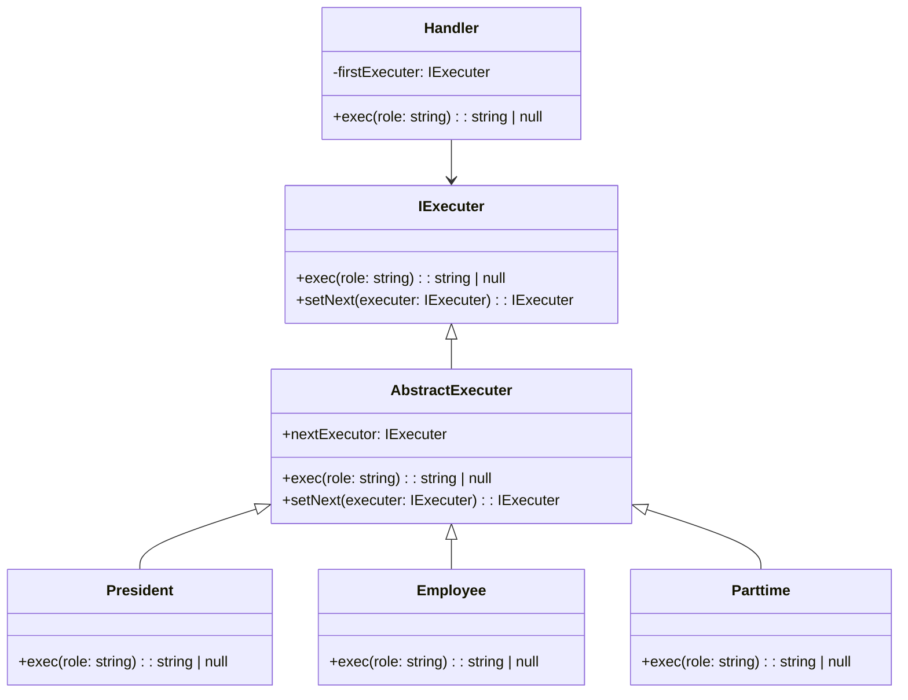

## 責任の連鎖

```mermaid
classDiagram
    class IExecuter {
        +exec(role: string): string | null
        +setNext(executer: IExecuter): IExecuter
    }

    class AbstractExecuter {
        +nextExecutor: IExecuter
        +exec(role: string): string | null
        +setNext(executer: IExecuter): IExecuter
    }

    class President {
        +exec(role: string): string | null
    }

    class Employee {
        +exec(role: string): string | null
    }

    class Parttime {
        +exec(role: string): string | null
    }

    class Handler {
        -firstExecuter: IExecuter
        +exec(role: string): string | null
    }

    IExecuter <|-- AbstractExecuter
    AbstractExecuter <|-- President
    AbstractExecuter <|-- Employee
    AbstractExecuter <|-- Parttime
    Handler --> IExecuter
```