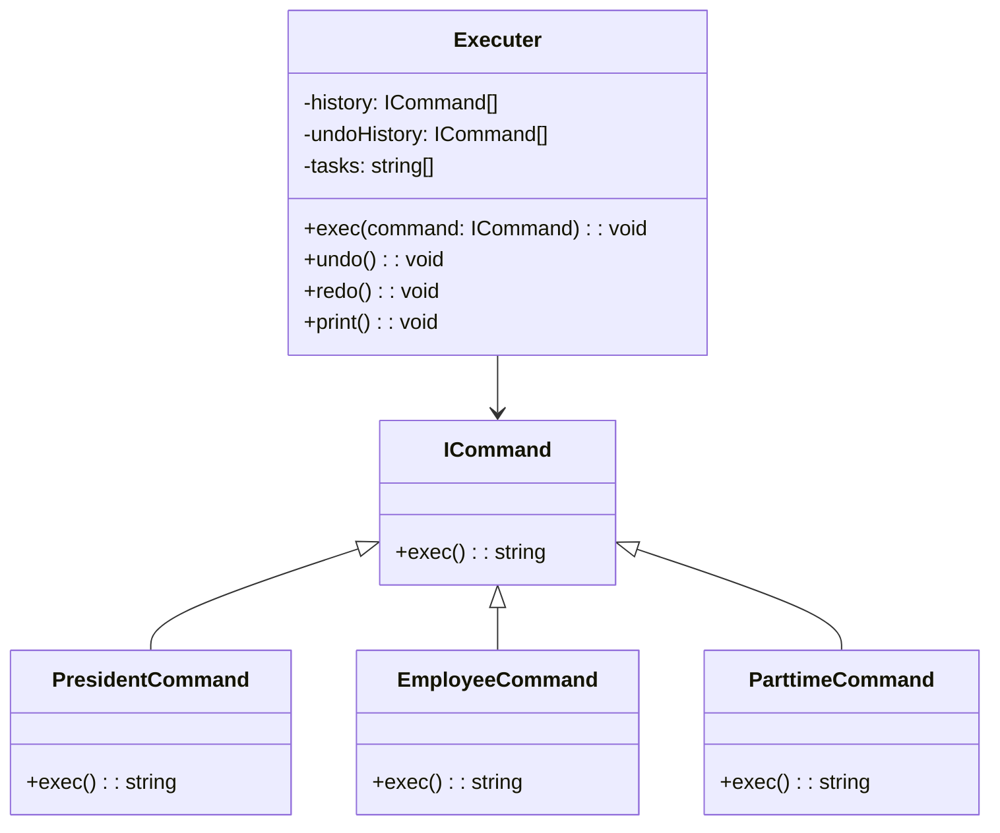

## コマンドパターン

```mermaid
classDiagram
    class ICommand {
        +exec(): string
    }

    class PresidentCommand {
        +exec(): string
    }

    class EmployeeCommand {
        +exec(): string
    }

    class ParttimeCommand {
        +exec(): string
    }

    class Executer {
        -history: ICommand[]
        -undoHistory: ICommand[]
        -tasks: string[]
        +exec(command: ICommand): void
        +undo(): void
        +redo(): void
        +print(): void
    }

    ICommand <|-- PresidentCommand
    ICommand <|-- EmployeeCommand
    ICommand <|-- ParttimeCommand

    Executer --> ICommand

```